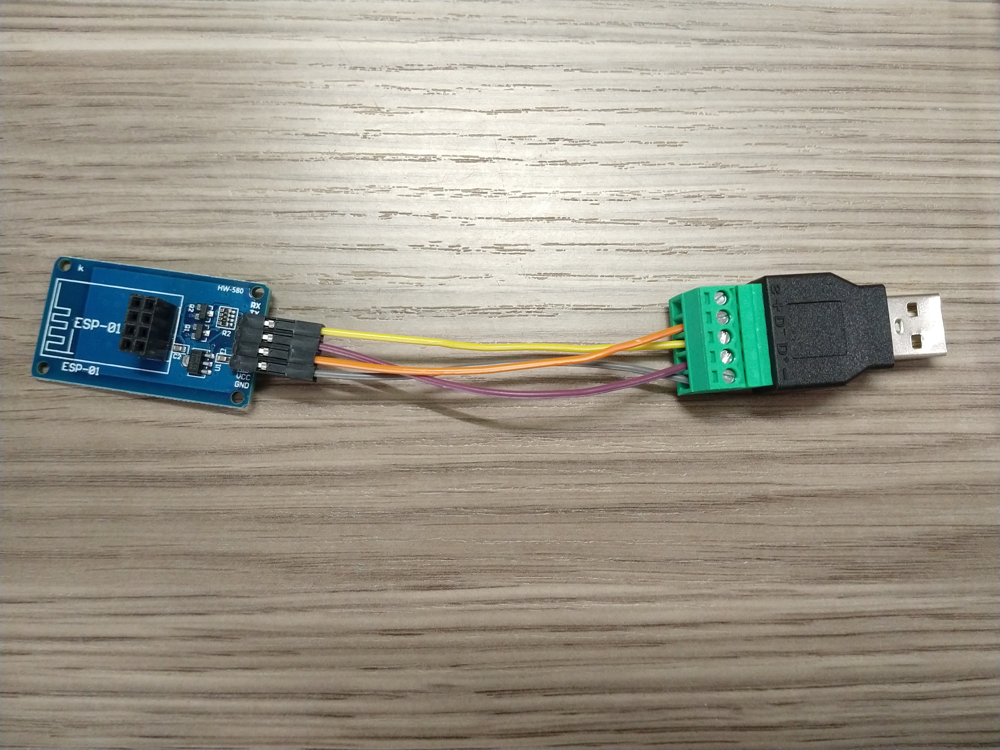
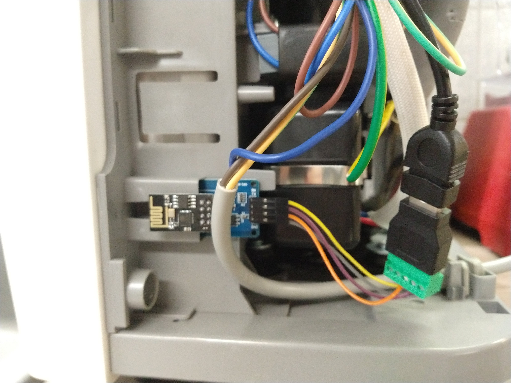

<div align="center">
    
    <p align="center"><h2>Free your dehumidifier from the cloud</h2></p>
</div>

This repo contains software to build a replacement wifi adapter for your wifi-enabled midea dehumidifier
which enables cloud-free operation utilizing MQTT.

Home Assistant Autodiscovery is supported, albeit not including the `humidifier` part, since there's no `humidifier.mqtt`
integration yet.
Furthermore, the WifiManager library is used for on-the-fly configuration.
Also, ArduinoOTA is used, so that firmware updates are possible even with a reassembled device.


If you're looking for the exact opposite of this, check out [esp8266-deerma-humidifier](https://github.com/Hypfer/esp8266-deerma-humidifier/).
Or maybe even use both simultaneously and see who wins?


This should work with all wifi-enabled Midea-made dehumidifiers. They are sold under different brands including:
* Comfee
* Inventor

Quoting from [node-mideahvac](https://github.com/reneklootwijk/node-mideahvac):

The WiFi interface [on these machines] is provided by a dongle, called WiFi SmartKey, either connected to an USB type-A
connector or a JST-HX type of connector. This dongle wraps the UART protocol used to communicate with the unit with a
layer for authentication and encryption for communication with a mobile app via the Midea cloud or directly via a local LAN connection.

However, it turned out the dongle is just connected to a serial interface (TTL level) of the unit.
This means an alternative is to hook up directly to this serial interface and bypass the cloud, authentication and encryption stuff,
[which is exactly what this project does].

## Compatibility list
This list contains all tested and known-working dehumidifiers:

* Midea MAD22S1WWT
* Comfee MDDF-20DEN7-WF
* Inventor Eva II PRO WI-FI

## Health and Safety
Please note that some of the supported dehumidifiers such as the Comfee MDDF-20DEN7-WF use R290 as its coolant which - [while having a much lower global warming potential than other coolants](https://en.wikipedia.org/wiki/Refrigerant#Environmental_issues) -
is also **Propane**.

Yes, _the_ **Propane**.

Therefore, when disassembling, please be extra careful so that you don't damage anything since a leak may result in
you blowing yourself up and/or burning your house down.

## Building the Adapter

This is how the finished replacement adapter I'm using looks like.

To build one of these, you will need:

* ESP8266 ESP-01 Module
* ESP-01 Serial Adapter Board with 3.3v to 5v Level Shifters
* USB A to Terminal Plug Adapter
* Some Dupont Cables
* Something to flash the ESP-01

Just source those from the supplier of your choice and compare product listings with this finished adapter photo.

For flashing the ESP-01, there are some nice and self-contained USB to ESP-01 Adapters.

However, they cannot flash the module without soldering an extra button to it.
You might want to get one of those as well and then follow [this instructable](https://www.instructables.com/id/USB-to-ESP-01-Board-Adapter-Modification/).

The firmware can be built and flashed using the Arduino IDE.

For this, you will need to add ESP8266 support to it by [using the Boards Manager](https://github.com/esp8266/Arduino#installing-with-boards-manager).

Furthermore, you will also need to install the following libraries using the Library Manager:

* ArduinoOTA 1.0.3
* ArduinoJSON 6.10.1
* PubSubClient 2.8.0
* WiFiManager 0.15.0

## Using the Adapter
Current supported features are:

* On/Off
* Mode
* Fan Speed
* Humidity Setpoint

Also, the WiFi indicator on the unit continues to work like it's the real wifi adapter.

### Configuring Wifi
Since this project is using the WifiManager library, the ESP8266 will open up a WiFi Access Point for its initial configuration
or if it is unable to connect to the previously configured WiFi.

The library pretends that said WiFi AP requires a captive portal which triggers a notification on recent android phones.
Simply connect to the AP with your phone, tap the "Login required"-notification and you should be able to configure everything.

If for any reason you require to reconfigure everything, you can simply push and the WiFi button of your Dehumidifier for three seconds.
This also deletes the config and opens up the initial configuration Access Point again.

### Controlling the Appliance
Since we're using the Home Assistant Autodiscovery feature, everything should just work™.

Do note that as of Home Assistant 0.115 there's no `humidifier.mqtt` component, which means, that control is done by
having multiple `fan.mqtt` entities (Fan Speed, Mode, Setpoint).

This will hopefully change in the future.

Until then as well as if you're using something else other than Home Assistant, you can of course also control it by manually sending
JSONs to the command mqtt topic of the unit:
```
esp8266-midea-dehumidifier/DEHUMIDIFIER-FFFFFF/command

{
	"state": "on",
	"humiditySetpoint": 55,
	"fanSpeed": "medium",
	"mode": "setpoint"
}
```
You can omit parameters that you don't want to change.

The current status of the unit will be published like this:
```
esp8266-midea-dehumidifier/DEHUMIDIFIER-FFFFFF/state

{
	"state": "on",
	"humiditySetpoint": 55,
	"humidityCurrent": 41,
	"errorCode": 0,
	"fanSpeed": "medium",
	"mode": "setpoint"
}
```

## Misc
As you can see, on the Comfee MDDF-20DEN7-WF, the replacement adapter actually fits inside the mounting point of the regular WiFi adapter.


## References and sources

The knowledge to create the logic to monitor and control the Midea-'like' AC units was gathered by reverse engineering Android applications from various vendors, analyzing the UART protocol between an Artel unit and an SK103 SmartKey, documents found on the Internet, primarily in Chinese and the work from:

* Mac Zhou: <https://github.com/mac-zhou/midea-msmart>
* NeoAcheron: <https://github.com/NeoAcheron/midea-ac-py>
* Rene Klootwijk: <https://github.com/reneklootwijk/node-mideahvac>
